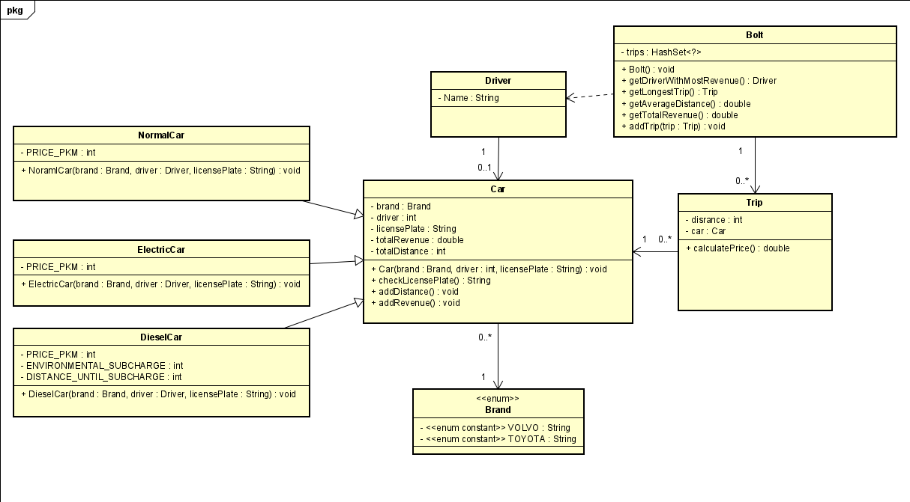

# Startdocument voor Bolt

Startdocument of **Max Appeldorn**. Student number **5049350**.

## Problem beschrijving

Het bedrijf BOLT is een bedrijf die het mogelijk maakt om via een App een auto aan te vragen en naar een bestemming toe te rijden. Aan de hand van het aantal kilometer, het soort auto wordt er een bedrag berekend die de klant moet betalen. 

Bolt maakt alleen maar gebruik van auto’s van het merk Toyota en Volvo. Alle auto’s hebben een chauffeur. 

Deze chauffeur heeft altijd een voornaam, mocht er geen voornaam opgegeven worden of alleen maar spaties, krijgt de chauffeur een standaardnaam “BoltDriver”. 

De auto’s hebben een merk en een Nederlandse kentekenplaat (formaat: 999-XX-9, drie cijfers, twee hoofdletters en nog een cijfer) Als de cijfers van de kentekenplaat niet voldoen komt er in de kentekenplaat -1 te staan op de plaats van de cijfers. Mochten de letters niet voldoen wordt dit null. Maak het zo dat kleine letters ook geaccepteerd worden.

Er zijn drie verschillende soorten auto’s die gereserveerd kunnen worden. Een gewone auto, deze heeft een prijs van 50 cent per kilometer. Een elektrische auto, deze heeft een prijs van 25 cent per kilometer en een dieselauto waarvoor niet alleen een prijs van 63 cent per kilometer geldt, maar ook een milieutoeslag van 3 euro per 10 kilometer. De ritten worden per kilometer afgerekend.

Bolt wil graag de volgende dingen:
*	Per rit het te betalen bedrag;
*	De totale inkomsten van alle auto’s;
*	De gemiddelde afstand van alle auto’s;
*	De rit met de langste afstand (Als er meer langste ritten zijn, geef dan de meest recente terug;
*	De chauffeur met de meeste omzet (Als er meer met dezelfde omzet zijn, maakt het niet uit welke teruggegeven wordt).

## Input & output
In deze paragraaf worden de in- en output van de applicatie beschreven.

### Input
In de onderstaande tabel wordt alle invoer (die de gebruiker moet invoeren om de applicatie te laten werken) beschreven.

|Case|Type|Conditions|
|----|----|----------|
|Naam van de chauffeur|`String` | not empty|
|kenteken|`String` | formaat: 999-XX-9|
|Merk| Brand | Volvo, Toyota|
|afstand|`int` | `number` > 0|
|auto | Car | geldige auto |

### Output

|Case|Type|
|----|----|
|prijs per rit |`double`|
|totale inkomsten van alle auto's | `double`|
|gemiddelde afstand van alle auto's | `double`|
|rit met langste afstand | `Rit`|
|chauffeur met meeste omzet | `Driver`|

### Calculations
| Case              | Calculation                        |
| ----------------- | ---------------------------------- |
| bedrag van een rit met een normale auto| afstand * 50 cent |
| bedrag van een rit met een elektrische auto| afstand * 25 cent |
| bedrag van een rit met een diesel auto| (afstand * 63 cent) + (3 * (afstand / 10)) |
| totale inkomsten | totale omzet van alle autos |
| gemiddele afstand van alle autos | totale afstand / totale auto's |

## Class Diagram

### Test Data

In de volgende tabel vindt u alle gegevens die nodig zijn voor het testen.

#### Bolt

| ID            | Input       | Code   |
| ------------- | ----------- |--------|
| `bolt` | | `new Bolt()` |

#### Driver

| ID        | Input                           | Code      |
| --------- | ------------------------------- | -----|
| `max` | naam: Max  | `new Driver("Max")` |
| `henk` | naam: Henk | `new Driver("Henk")` |
| `boltDriver` | naam: `   ` | `new Driver("   ")`| 

#### Car

| ID            | Input       | Code   |
| ------------- | ----------- |--------|
| `normalCar` | merk: VOLVO  chauffeur: max   kenteken: 11A-a1-2  | `new NormalCar(Brand.VOLVO, max, "333-CC-3")` |
| `dieselCar` | merk: VOLVO  chauffeur: henk   kenteken: 222-BB-2 | `new DieselCar(Brand.VOLVO, henk, "222-BB-2")` |
| `electricCar` | merk: TOYOTA  chauffeur: boltDriver   kenteken: 111-AA-1 | `new ElectricCar(Brand.TOYOTA, boltDriver, "111-AA-1")` |

### Trip

| ID            | Input       | Code   |
| ------------- | ----------- |--------|
| `trip1` | afstand: 10   auto: normalCar | `new Trip(10, normalCar)` |
| `trip2` | afstand: 25   auto: electricCar | `new Trip(25, electricCar)` |
| `trip3` | afstand: 32   auto: dieselCar | `new Trip(32, dieselCar)` |

### Test Cases

In deze paragraaf worden de testgevallen beschreven. Elke testcase moet worden uitgevoerd met de testgegevens als uitgangspunt.

#### #1 totale omzet

|Step|Input|Action|Expected output|
|----|-----|------|---------------|
|1|         | `bolt.getTotalRevenue()`  | 0 |
|2| `trip1` | `bolt.addTrip(trip1)`     |   |
|3|         | `bolt.getTotalRevenue()`  | 5 |
|4| `trip2` | `bolt.addTrip(trip2)`     |   |
|5|         | `bolt.getTotalRevenue()`  | 11.25 |
|6| `trip3` | `bolt.addTrip(trip3)`     |   |
|7|         | `bolt.getTotalRevenue()`  | 40.41 |

#### #2 gemiddelde afstand

|Step|Input|Action|Expected output|
|----|-----|------|---------------|
|1|         | `bolt.getAverageDistance()` | 0 |
|2| `trip1` | `bolt.addTrip(trip1)`     |   |
|3|         | `bolt.getAverageDistance()`  | 10 |
|4| `trip2` | `bolt.addTrip(trip2)`     |   |
|5|         | `bolt.getAverageDistance()`  | 17.5 |
|6| `trip3` | `bolt.addTrip(trip3)`     |   |
|7|         | `bolt.getAverageDistance()`  | 22.33 |
|8| afstand: `15`   auto: normalCar | `new Trip(15, normalCar)`     |   |
|9| `trip4` | `bolt.addTrip(trip4)`     |   |
|10|         | `bolt.getAverageDistance()`  | 27.33 |

#### #3 langste afstand

|Step|Input|Action|Expected output|
|----|-----|------|---------------|
|1|  | `bolt.getLongestTrip()` | null |
|2| `trip1` | `bolt.addTrip(trip1)`     |   |
|3|         | `bolt.getLongestTrip()`  | trip1 |
|4| `trip2` | `bolt.addTrip(trip2)`     |   |
|5|         | `bolt.getLongestTrip()`  | trip3 |
|6| `trip3` | `bolt.addTrip(trip3)`     |   |
|7|         | `bolt.getLongestTrip()`  | trip3 |
|8| afstand: `32`   auto: normalCar | `new Trip(32, normalCar)`     |   |
|9| `trip4` | `bolt.addTrip(trip4)`     |   |
|10|         | `bolt.getLongestTrip()`  | trip4 |

#### #4 meeste omzet van een chauffeur

|Step|Input|Action|Expected output|
|----|-----|------|---------------|
|1|  | `bolt.getDriverWithMostRevenue()` | null |
|2| `trip1` | `bolt.addTrip(trip1)`     |   |
|3|         | `bolt.getDriverWithMostRevenue()`  | max |
|4| `trip2` | `bolt.addTrip(trip2)`     |   |
|5|         | `bolt.getDriverWithMostRevenue()`  | boltDriver |
|6| `trip3` | `bolt.addTrip(trip3)`     |   |
|7|         | `bolt.getDriverWithMostRevenue()`  | henk |
|8| afstand: `50`   auto: normalCar | `new Trip(32, normalCar)`     |   |
|9| `trip4` | `bolt.addTrip(trip4)`     |   |
|10|         | `bolt.getDriverWithMostRevenue()`  | max |

### #5 lege chauffeurs naam

|Step|Input|Action|Expected output|
|----|-----|------|---------------|
|1| |`boltDriver.getName()` | `boltDriver`|

### #6 format van kenteken

|Step|Input|Action|Expected output|
|----|-----|------|---------------|
|1| |`normalCar.getLicensePlate()` | `11-1-anull-2`|
|2| |`dieselCar.getLicensePlate()` | `222-BB-2`|